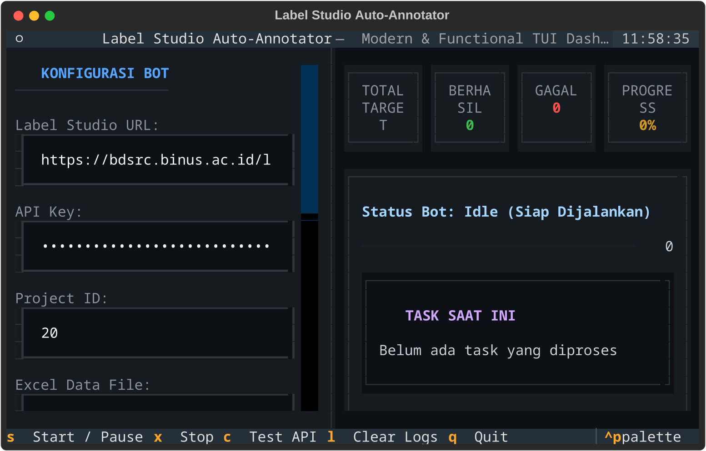

# 🤖 Label Studio Auto-Annotation Bot

Bot otomatisasi ringan untuk memasukkan hasil anotasi data dari file Excel (`.xlsx`) ke platform **Label Studio** secara otomatis. Dilengkapi tampilan terminal interaktif (**TUI Dashboard**) yang modern, bersih, dan mudah digunakan.



---

## 🌟 Mengapa Menggunakan Bot Ini?

- **⚡ Hemat Waktu & Tenaga**: Tidak perlu memasukkan data label satu per satu secara manual di web browser.
- **🛡️ Aman & Natural (*Human-like Delay*)**: Memiliki fitur jeda waktu acak (15–30 detik) antar pengisian data agar proses anotasi terlihat alami dan tidak dianggap spam oleh server.
- **📊 Pantau Progres Secara Live**: Dashboard statistik menampilkan jumlah data target, jumlah berhasil, gagal, serta persentase progres secara real-time.
- **🎛️ Kontrol Penuh**: Anda dapat menguji koneksi API, memulai, menghentikan sementara (*pause*), atau membatalkan proses kapan saja langsung dari tombol terminal.

---

## 📋 Persyaratan Sebelum Memulai

Pastikan komputer Anda sudah terpasang:
1. **Python 3.8** atau versi yang lebih baru.
2. **Kunci API (API Key)** dari akun Label Studio Anda.
3. File data hasil anotasi bertipe `.xlsx` (Excel) dan file filter `.json`.

---

## 🚀 Panduan Instalasi (4 Langkah Mudah)

### 1. Unduh Project
Buka Terminal atau Command Prompt, lalu jalankan:
```bash
git clone https://github.com/Hilal06/LabelStudioBot.git
cd LabelStudioBot
```

### 2. Buat Lingkungan Kerja (Virtual Environment)
```bash
python3 -m venv venv
```
Aktifkan lingkungan kerja:
- **Linux / macOS:**
  ```bash
  source venv/bin/activate
  ```
- **Windows:**
  ```bash
  venv\Scripts\activate
  ```

### 3. Install Dependensi
```bash
pip install -r requirements.txt
```

---

## ⚙️ Pengaturan Data & Kunci API

### 1. Buat File `.env`
Buat file baru bernama `.env` di folder project, lalu isi sesuai akun Label Studio Anda:
```env
LABEL_STUDIO_URL=https://bdsrc.binus.ac.id/label-studio/
LABEL_STUDIO_API_KEY=KODE_API_KEY_ANDA_DI_SINI
LABEL_STUDIO_PROJECT_ID=20
EXCEL_FILE=Annotated_Tweets_Cleaned.xlsx
ID_FILTER_FILE=test_data.json
```

### 2. Atur Target Data (`test_data.json`)
Tentukan baris data mana yang ingin diproses oleh bot:
- **Rentang ID (Contoh: ID 811 sampai 815):**
  ```json
  {
      "dari": 811,
      "sampai": 815
  }
  ```
- **Pilihan ID Spesifik (Contoh: ID tertentu saja):**
  ```json
  [806, 807, 810, 815]
  ```

---

## 🎮 Cara Menjalankan Bot

Pastikan Virtual Environment sudah aktif (ditandai dengan tulisan `(venv)` di terminal), lalu jalankan:

```bash
python3 bot_tui.py
# ATAU
python3 bot_entry_anotation.py
```

### ⌨️ Tombol Navigasi Terminal:
| Tombol | Fungsi |
| :---: | :--- |
| `S` | **Start / Pause** (Mulai atau Hentikan Sementara) |
| `X` | **Stop** (Hentikan seluruh proses anotasi) |
| `C` | **Test API** (Uji koneksi ke server Label Studio) |
| `L` | **Clear Logs** (Bersihkan tampilan papan log) |
| `Q` | **Quit** (Keluar dari aplikasi TUI) |

> 💡 *Catatan: Jika Anda ingin menjalankan bot versi teks biasa tanpa tampilan grafik TUI, tambahkan perintah `--cli`:*
> ```bash
> python3 bot_entry_anotation.py --cli
> ```

---

## ❓ Troubleshooting Sederhana

- **Error: `ModuleNotFoundError: No module named 'pandas'`**
  *Solusi*: Pastikan Anda sudah mengaktifkan lingkungan kerja Virtual Environment dengan perintah `source venv/bin/activate` sebelum menjalankan script.
